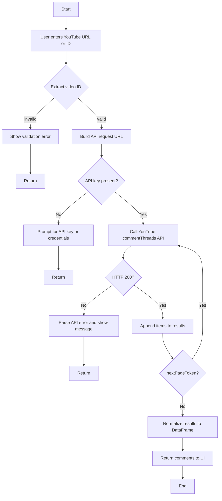
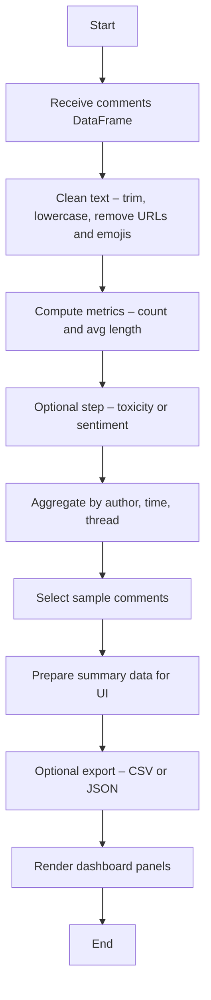
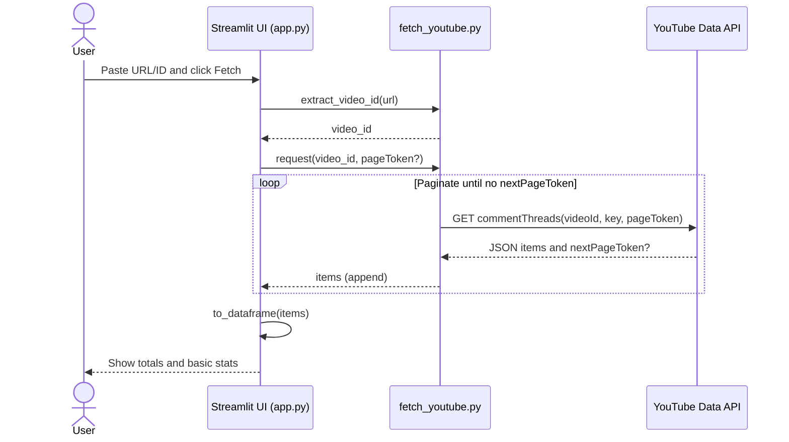
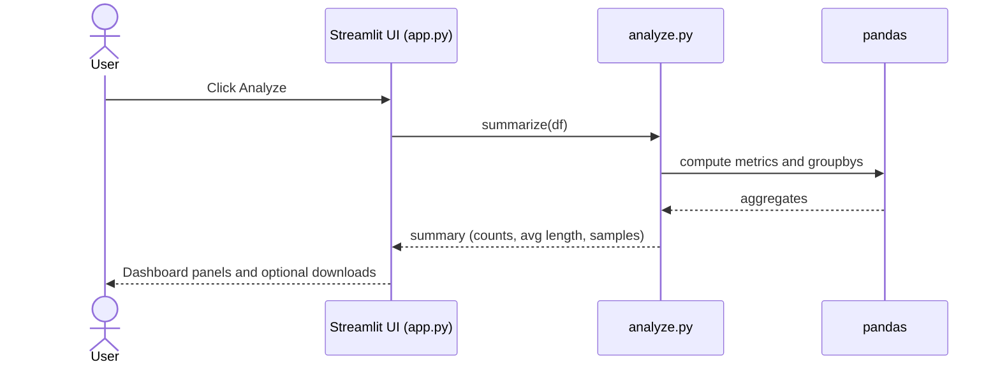
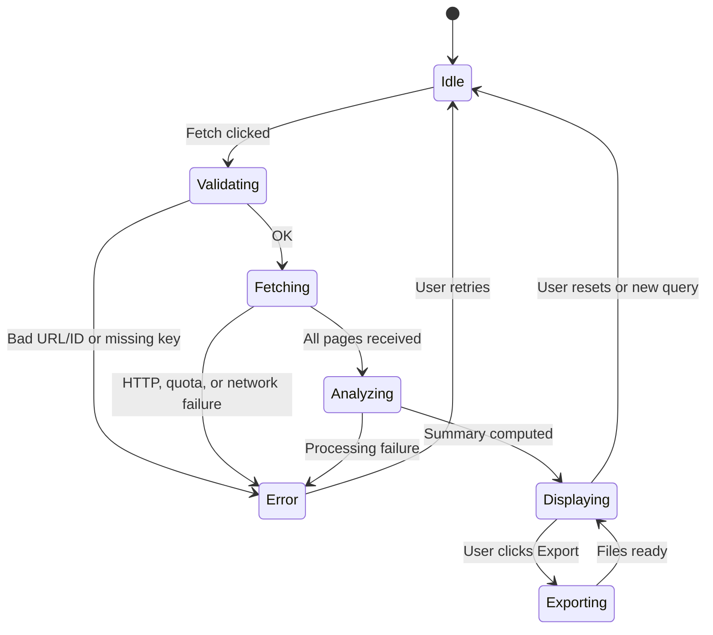
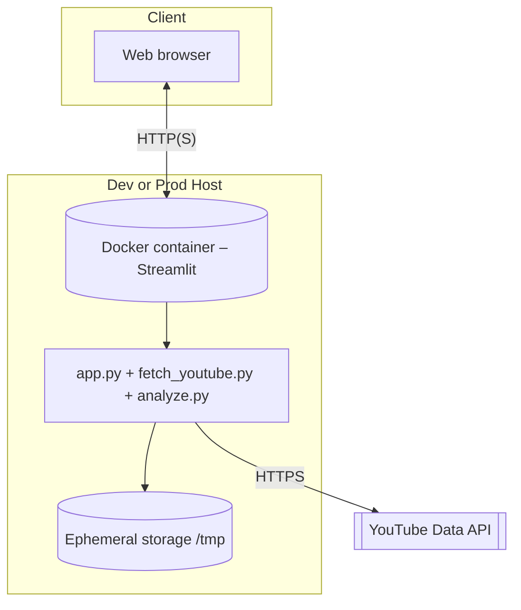

# Comment Analyzer – UML Diagrams (DB-less)

Below are activity, sequence, state, component, and deployment diagrams for the DB-less version of the Comment Analyzer.

---

## Activity Diagram 1 – Fetch YouTube Comments






```mermaid
A[Launch app.py (Streamlit)] --> B[Render input form]
    B --> C{User clicks "Fetch"?}
    C -->|No| B
    C -->|Yes| D[extract_video_id called]
    D --> E[Fetch pages and build DataFrame]
    E --> F[Summarize data]
    F --> G[Update UI – counts, averages, samples]
    G --> H{User clicks Export?}
    H -->|Yes| I[Write CSV or JSON to temp storage]
    H -->|No| J[Keep in memory]
    I --> K[Provide download buttons]
    J --> K
    K --> L[Done]
```










```mermaid
flowchart LR
    subgraph UI[Streamlit UI (app.py)]
        UI1[Forms and buttons]
        UI2[Pages and panels]
        UI3[Session state]
    end

    FY[fetch_youtube.py<br/>extract_video_id<br/>request]
    AZ[analyze.py<br/>summarize<br/>aggregates]
    EX[Exporter<br/>to_csv, to_json]
    CFG[Config /.streamlit]
    FS[(Local temp storage)]
    GAPI[[YouTube Data API]]

    UI1 --> FY
    FY --> GAPI
    FY --> UI2
    UI2 --> AZ
    AZ --> UI2
    EX --> FS
    UI3 --> EX
    CFG --> UI
```

